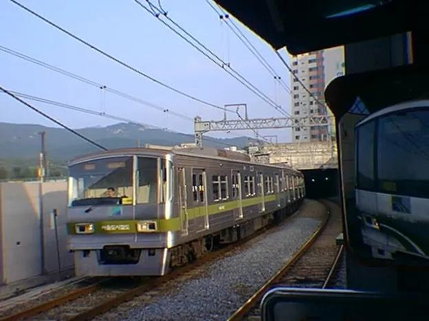

# svcm
ResNet34 모델을 기반으로 지하철 차량의 형상으로 차종 구분하는 모델 학습  
SVCM은 'Subway Vehicle Classification Model'의 약자입니다.

## 구성
| 파일 또는 폴더 이름                             | 설명                       |
|------------------------------------------------|---------------------------|
| [app](./app)                                   | 샘플 안드로이드 앱 소스코드 |
| [datasets](./datasets)                         | 지하철 차량 이미지 데이터셋 |
| [models](./models)                             | 학습된 모델                |
| [classification.ipynb](./classification.ipynb) | ResNet 기반 학습 코드      |

## 요구사항
학습을 하기 위해선 아래의 요구사항이 필요합니다.
1. Anaconda  
Jupyter Notebook을 통해 [classification.ipynb](./classification.ipynb)을 실행하려면 Anaconda가 필요합니다.
2. GPU  
필수는 아니지만 빠른 학습을 위해 CUDA를 지원하는 GPU가 필요합니다.
3. PyTorch  
PyTorch 2.0.0 이상의 패키지를 권장합니다.  
torchvision 패키지의 버전이 0.15.0 이상이어야 올바르게 작동하므로 아래의 명령어를 통해 최신 PyTorch를 설치합니다.
```console
conda install pytorch torchvision torchaudio pytorch-cuda=11.7 -c pytorch -c nvidia
```
CUDA 버전이 다르거나 CPU로 학습을 할 경우에는 PyTorch 설치 명령이 달라질 수 있습니다.

또한 안드로이드 앱 빌드를 위해 [Android Studio](https://developer.android.com/studio)가 필요합니다.

## [데이터셋](./datasets)
수도권 전철 7호선에 운행중인 열차 5종에 대한 전두부, 측면부 사진 총 128장으로 구성되어 있으며 각 차종별 이미지 수는 다음과 같습니다.
| 순번 | 대표사진                                      | 종류 | 이미지 수 |
|------|----------------------------------------------|------|----------|
| 1    |   | 1차분 | 7       |
| 2    |  | 2차분 | 30      |
| 3    |   | 3차분 | 31      |
| 4    |  | 4차분 | 30      |
| 5    |   | 5차분 | 30      |

각 차량별 실제 특성은 나무위키의 [서울 지하철 7호선 7000호대 전동차](https://namu.wiki/w/%EC%84%9C%EC%9A%B8%20%EC%A7%80%ED%95%98%EC%B2%A0%207%ED%98%B8%EC%84%A0%207000%ED%98%B8%EB%8C%80%20%EC%A0%84%EB%8F%99%EC%B0%A8#s-4) 문서의 분류 항목을 확인해주세요.

## 샘플 앱
해당 모델의 사용 예시를 보여주기 위해 샘플 앱을 제작하였습니다.  
샘플 앱에서는 카메라로 플랫폼에 있는 열차를 비추면 차종별 특성을 승객에게 안내해줍니다.  
열차 차종을 앱을 통해 구분하여 열차 이용에 장애가 될 수 있는 요인을 확인할 수 있는 배리어 프리 앱의 예시입니다.

### 데모 영상
7호선의 종점인 도봉산역에서 촬영하였습니다.
#### 2차분
https://github.com/wise1ight/svcm/assets/59006393/caac1afc-d213-4dcd-bc03-dd12b474daa5
#### 5차분
https://github.com/wise1ight/svcm/assets/59006393/b576b632-ac52-4a9c-a0d2-40f4f3e98b53

## 앞으로 해야 할 일
1. 다양한 모델을 사용해 보면서 성능 비교
2. 데이터셋 추가
3. 앱 기능 개선

## 참고자료
[Tensorflow를 이용한 애완동물 영상 세부 분류](https://koreascience.kr/article/CFKO202023758834506.pdf)  
[Oxford-IIIT Pets-Pytorch](https://github.com/Skuldur/Oxford-IIIT-Pets-Pytorch)  
[PyTorch for Android - Image Classification App](https://www.youtube.com/watch?v=ghxLlsT7ebo)
